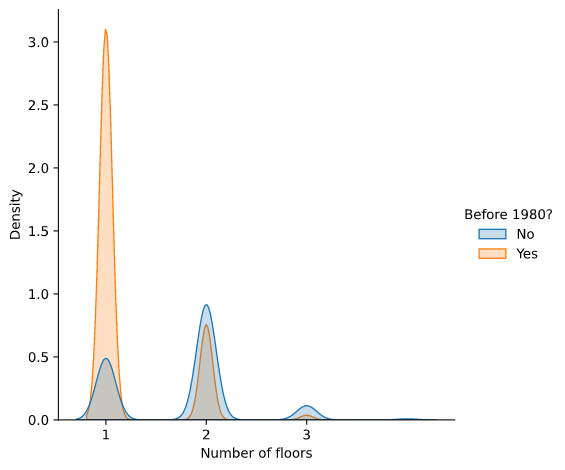
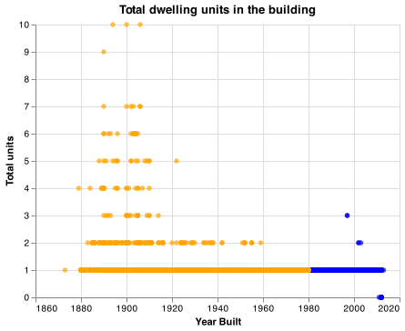
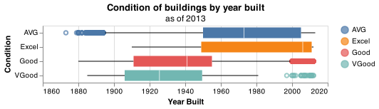
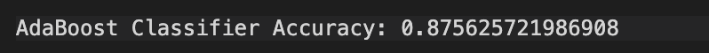
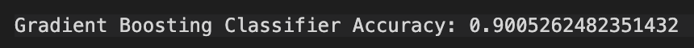
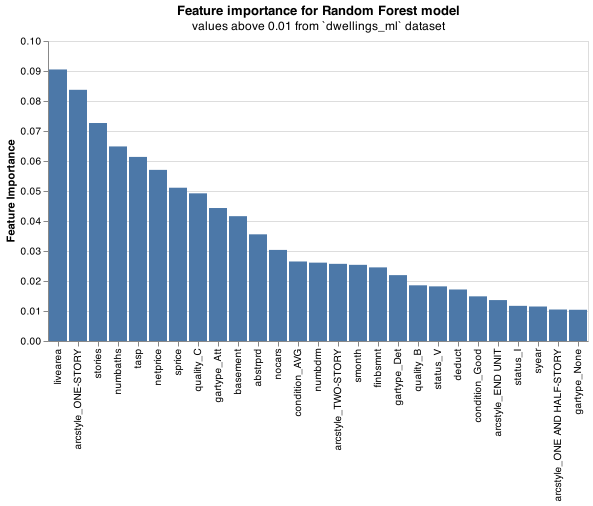
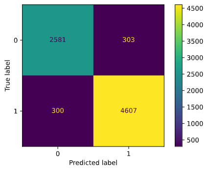

# Can you predict that?

__Mars Biziyabal__

## Elevator pitch

In 1976, the U.S. Environmental Protection Agency (EPA) restricted the use of paint with [asbestos](https://en.wikipedia.org/wiki/Asbestos) (fibrous material that causes severe lung conditions).  This project aims to classify if a house is built pre 1980, using the home sales data of Denver, Colorado from 2013. We will use machine learning algorithms AdaBoost, GradientBoosting, and RandomForest to classify and we'll choose the best performing algorithm and discuss the evaluation metrics. 

## TECHNICAL DETAILS

### GRAND QUESTION 1

##### Find 2-3 potential relationships between the home variables and `before1980`

1. The plot below shows the distribution of the number of floors of the buildings finished before and after 1980. We can see that buildings with only one floor are most likely to be built before 1980.

---

2. The graph below is a scatter plot of the total dwelling units in the building by the year it was built. It tells us that having more than three dwelling units is almost certain to be built before 1980. If it has more than one dwelling unit in the building, there's a higher chance that it could be built before 1980.

---

3. Lets look at the condition of the buildings by their year built. There are a total of 24,300 observations in the data and here's a table that breaks down the condition of each building. 
    

| condition   |   count |
|:------------|--------:|
| AVG         |   17807 |
| Excel       |      25 |
| Fair        |       1 |
| Good        |    4716 |
| None        |     295 |
| VGood       |     364 |
| nan         |    1092 |

I will drop the columns: 
    - `Fair` - only has one observation ,
    - `None` - there were no information on what year they were built,
    - `nan` - because missing values

Below we see a boxplot for the 4 conditions: 

- `AVG` has a little over 50% of the houses built before 1980.
- Around 70% of the `Excel` conditioned buildings were built after 1980.
- About 80% of the `Good` buildings were built before 1980. 
- Almost 99% of `VGood` buildings are built before 1980. 

### GRAND QUESTION 2
##### Build classification model that determines wether building was built before or after 1980 -- with at least 90% accuracy.

To classify if the building was built before or after 1980, we will try using three classifying algorithms - AdaBoost Classifier, Gradient Boosting Classifier, and Random Forest Classifier. Here are the accuracy for the models, using all the variables except `yrbuilt`, and `before1980`. 

The Random Forest Classifier has the highest accuracy with classifying correctly __92%__ of the time. 

### GRAND QUESTION 3

##### Random forest model's feature importance

Here are the features used in the model, that were most useful in helping classify the target. We can see that a one story building happened to be the best feature in predicting when the houses were built. Since we used all the 49 columns from the dataset, the feature values above 0.01 were used to graph this chart. Lets use only these 26 features below and see how they differ using the same Random Forest model. 

Using the 26 most important features gave us a slightly higher accuracy. It was better to exclude the less important features so that the model does not train on excessive noise. 

### GRAND QUESTION 4

Below we have a confusion matrix. The True Positive (TP, bottom right) is the correct classification of housing built before 1980 and True Negative (TN, top left) is the correct classification of housing built after 1980. The False Positive (FP, top right) is the model classifying that a housing is built before 1980 when it was built after 1980 and False Negative (FN, bottom left) is when the model classifies a housing is built after 1980 when it was built before 1980. 

From the values above we can calculate precision, recall, and the f1-score. 

Precision = $\dfrac{TP}{TP+FP}$ or what proportion of classifying 'before 1980' was actually correct?

Recall = $\dfrac{TP}{TP+FN}$ or what proportion of actual 'before 1980' was classified correct?

F1-score is the mean of precision and recall. 

Support is the sum of true and false responses. 

|              |   precision |   recall |   f1-score |     support |
|:-------------|------------:|---------:|-----------:|------------:|
| 0            |    0.896086 | 0.897018 |   0.896552 | 2884        |
| 1            |    0.939437 | 0.938863 |   0.93915  | 4907        |
| accuracy     |    0.923373 | 0.923373 |   0.923373 |    0.923373 |
| macro avg    |    0.917762 | 0.91794  |   0.917851 | 7791        |
| weighted avg |    0.92339  | 0.923373 |   0.923381 | 7791        |

