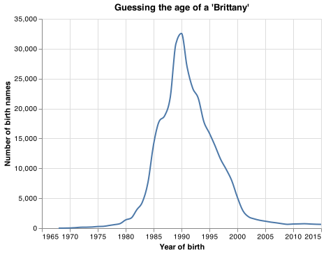
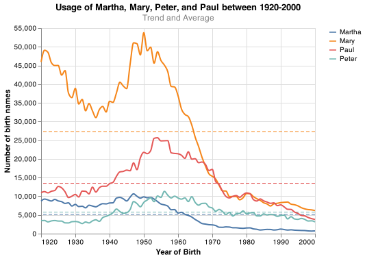
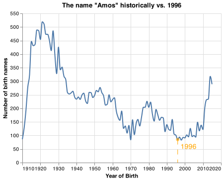
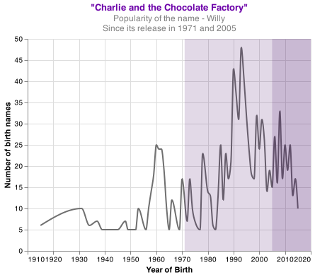

# What is in a name?

## Elevator pitch

The `names` dataset includes the count of birth names recorded between 1910 and 2015 from each state in the US. This report will touch on questions about birth names and their "popularity" during the birth year, estimating a person's age based on historical trends, and how biblical names are given throughout the years. 

The source of this data is https://data.world/government/us-baby-names-by-state

Here is a random sample of the dataset we will be working with. 

|        | name    |   year |   AK |   AL |   AR |   AZ |   CA |   CO |   CT |   DC |   DE |   FL |   GA |   HI |   IA |   ID |   IL |   IN |   KS |   KY |   LA |   MA |   MD |   ME |   MI |   MN |   MO |   MS |   MT |   NC |   ND |   NE |   NH |   NJ |   NM |   NV |   NY |   OH |   OK |   OR |   PA |   RI |   SC |   SD |   TN |   TX |   UT |   VA |   VT |   WA |   WI |   WV |   WY |   Total |
|-------:|:--------|-------:|-----:|-----:|-----:|-----:|-----:|-----:|-----:|-----:|-----:|-----:|-----:|-----:|-----:|-----:|-----:|-----:|-----:|-----:|-----:|-----:|-----:|-----:|-----:|-----:|-----:|-----:|-----:|-----:|-----:|-----:|-----:|-----:|-----:|-----:|-----:|-----:|-----:|-----:|-----:|-----:|-----:|-----:|-----:|-----:|-----:|-----:|-----:|-----:|-----:|-----:|-----:|--------:|
| 152590 | Grecia  |   1999 |    0 |    0 |    0 |    5 |   46 |    0 |    0 |    0 |    0 |    0 |    0 |    0 |    0 |    0 |    8 |    0 |    0 |    0 |    0 |    0 |    0 |    0 |    0 |    0 |    0 |    0 |    0 |    0 |    0 |    0 |    0 |    0 |    0 |    0 |    0 |    0 |    0 |    0 |    0 |    0 |    0 |    0 |    0 |   28 |    0 |    0 |    0 |    0 |    0 |    0 |    0 |      87 |
| 112378 | Edison  |   1975 |    0 |    0 |    0 |    0 |    0 |    0 |    0 |    0 |    0 |    0 |    0 |    0 |    0 |    0 |    0 |    0 |    0 |    0 |    0 |    0 |    0 |    0 |    0 |    0 |    0 |    0 |    0 |    0 |    0 |    0 |    0 |    8 |    0 |    0 |    8 |    0 |    0 |    0 |    0 |    0 |    0 |    0 |    0 |    0 |    0 |    0 |    0 |    0 |    0 |    0 |    0 |      16 |
| 140670 | Freeman |   1984 |    0 |    0 |    0 |    0 |    0 |    0 |    0 |    0 |    0 |    0 |    0 |    0 |    0 |    0 |    0 |    5 |    0 |    0 |    0 |    0 |    0 |    0 |    0 |    0 |    0 |    0 |    0 |    0 |    0 |    0 |    0 |    0 |    0 |    0 |    0 |    0 |    0 |    0 |    0 |    0 |    0 |    0 |    0 |    0 |    0 |    0 |    0 |    0 |    0 |    0 |    0 |       5 |
| 356073 | Tad     |   1962 |    0 |    0 |    0 |    0 |   19 |    0 |    0 |    0 |    0 |    0 |    0 |    0 |    9 |    0 |    5 |    0 |    0 |    0 |    0 |    0 |    0 |    0 |    8 |    7 |    0 |    0 |    0 |    0 |    0 |    0 |    0 |    0 |    0 |    0 |    6 |   11 |    0 |    8 |    6 |    0 |    0 |    5 |    0 |    9 |    7 |    0 |    0 |   14 |    5 |    0 |    0 |     119 |
| 156898 | Harmon  |   1956 |    0 |    0 |    0 |    0 |    0 |    0 |    0 |    0 |    0 |    6 |    0 |    0 |    0 |    0 |    0 |    0 |    0 |    0 |    0 |    0 |    0 |    0 |    0 |    0 |    0 |    0 |    0 |    0 |    0 |    0 |    0 |    0 |    0 |    0 |    0 |    0 |    0 |    0 |    0 |    0 |    5 |    0 |    0 |    0 |    0 |    0 |    0 |    0 |    0 |    0 |    0 |      11 |

## TECHNICAL DETAILS

### Guessing the age of someone named "Brittany"

The line graph below shows the birth name trend of Brittanys recorded between 1968 - 2015. Starting early 1980s, the popularity of the name started increasing. In 1990, the name reached its peak popularity with 32,562 recorded cases. Fun fact -- between 1989-1991, Brittany was ranked #3 of most popular name in the US. 

If you talked with someone named Brittany on the phone, what is your guess of their age? What ages would you not guess?

My initial guess would be 31 because 1990 was the highest recorded count of Brittanys. The most probable range would be to guess between 26-36. They would be born between 1985-1995, where there are more than 14,000 records of Brittanys. Pre 1980 and post-2002 would not be a part of my guess. 

### Comparing Christian names from 1920 - 2000

Lets look at how Biblical names Martha, Mary, Peter, and Paul have trended in the past. 

Mary was the most popular name in the US until the mid-1900s, and the graph shows that it is significantly higher than the other names -- with an average of ~27000 babies named Mary per year. It reached its peak in 1950 and has declined since. You will notice that around the 50s, these names have started decreasing in popularity. Could it be the era of 'Rock n Roll' or the 'Golden Age of Television' that played a part in this downturn? :thinking:

### Historical comparison of your birth name and year

My birth name is Amarsanaa, and I go by Mars, and neither were in the dataset. So to answer this question, I used the `sample()` method and randomly selected the name __Amos__.

The name originates from Hebrew, meaning - "to carry" or "borne by God." Amos was a Biblical prophet who wrote the book of Amos. Since it is a Biblical name, can we assume that the trend will decrease around the 1950s?

In 1996, the popularity of the name Amos was at a historical lower count at 85. Between 1910-2015, the name reached the highest count in 1921 at 519. Since then, the popularity decreased to 83, the lowest point recorded in 1998.  Three significant drops are starting, the mid-1920s, mid-1950s, and mid-1980s. Can we assume that the 1950s was the "fall" of Christian names?
## Names in movies, and their popularity since its release

The movie "Charlie and the Chocolate Factory" is based on a 1964 UK novel by Roal Dahl. The movies were released in 1971 and the second adaptation in 2005. The graph shows the trend of the name Willy, the factory owner. Before the movie was released, the name ranged between 5 and 10 before a leap to 25 in 1960. Since its release in 1971, we see a spike, increasing where it peaked at 48 in 1993. When the later version released in 2005, there was an increase in the next few years until it decreased. 
