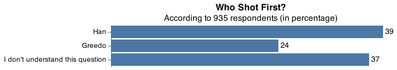
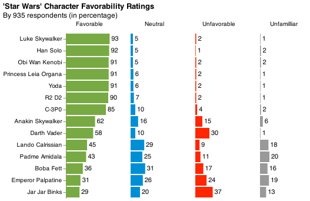

# The war with Star Wars

__Mars Biziyabal__

## Elevator pitch

Using FiveThirtyEight's [survey data](https://github.com/fivethirtyeight/data/tree/master/star-wars-survey) on [America's Favorite 'Star Wars' Movies (And Least Favorite Characters)](https://fivethirtyeight.com/features/americas-favorite-star-wars-movies-and-least-favorite-characters/), we will build a machine learning model that predicts whether a person makes more than \$50k. Survey data tend be to messy, so we'll use `pandas` to prepare our data for the machine learning model. 

## TECHNICAL DETAILS

### GRAND QUESTION 1

Here are the 38 column names of the original data. Notice the `Unnamed:` columns follow a question with more than 2 answers. Our task is to shorten the column names and replace `Unnamed:` column values with the different responses to the question. 

| RespondentID   | Have you seen any of the 6 films in the Star Wars franchise?   | Do you consider yourself to be a fan of the Star Wars film franchise?   | Which of the following Star Wars films have you seen? Please select all that apply.   | Unnamed: 4   | Unnamed: 5   | Unnamed: 6   | Unnamed: 7   | Unnamed: 8   | Please rank the Star Wars films in order of preference with 1 being your favorite film in the franchise and 6 being your least favorite film.   | Unnamed: 10   | Unnamed: 11   | Unnamed: 12   | Unnamed: 13   | Unnamed: 14   | Please state whether you view the following characters favorably, unfavorably, or are unfamiliar with him/her.   | Unnamed: 16   | Unnamed: 17   | Unnamed: 18   | Unnamed: 19   | Unnamed: 20   | Unnamed: 21   | Unnamed: 22   | Unnamed: 23   | Unnamed: 24   | Unnamed: 25   | Unnamed: 26   | Unnamed: 27   | Unnamed: 28   | Which character shot first?   | Are you familiar with the Expanded Universe?   | Do you consider yourself to be a fan of the Expanded Universe?ξ   | Do you consider yourself to be a fan of the Star Trek franchise?   | Gender   | Age   | Household Income   | Education   | Location (Census Region)   |
|----------------|----------------------------------------------------------------|-------------------------------------------------------------------------|---------------------------------------------------------------------------------------|--------------|--------------|--------------|--------------|--------------|-------------------------------------------------------------------------------------------------------------------------------------------------|---------------|---------------|---------------|---------------|---------------|------------------------------------------------------------------------------------------------------------------|---------------|---------------|---------------|---------------|---------------|---------------|---------------|---------------|---------------|---------------|---------------|---------------|---------------|-------------------------------|------------------------------------------------|---|--------------------------------------------------------------------|----------|-------|--------------------|-------------|----------------------------|

After replacing and shortening the column names, the column headers now look like:
(See `Grand Question 1` in the Appendix at the end of report)

| respondentid   | seen_any   | star_wars_fans   | seen__i__the_phantom_menace   | seen__ii__attack_of_the_clones   | seen__iii__revenge_of_the_sith   | seen__iv__a_new_hope   | seen__v_the_empire_strikes_back   | seen__vi_return_of_the_jedi   | rank__i__the_phantom_menace   | rank__ii__attack_of_the_clones   | rank__iii__revenge_of_the_sith   | rank__iv__a_new_hope   | rank__v_the_empire_strikes_back   | rank__vi_return_of_the_jedi   | view__han_solo   | view__luke_skywalker   | view__princess_leia_organa   | view__anakin_skywalker   | view__obi_wan_kenobi   | view__emperor_palpatine   | view__darth_vader   | view__lando_calrissian   | view__boba_fett   | view__c-3p0   | view__r2_d2   | view__jar_jar_binks   | view__padme_amidala   | view__yoda   | shot_first   | know_expanded   | expanded_fan   | star_trek_fan   | gender   | age   | household_income   | education   | location_(census_region)   |
|----------------|------------|------------------|-------------------------------|----------------------------------|----------------------------------|------------------------|-----------------------------------|-------------------------------|-------------------------------|----------------------------------|----------------------------------|------------------------|-----------------------------------|-------------------------------|------------------|------------------------|------------------------------|--------------------------|------------------------|---------------------------|---------------------|--------------------------|-------------------|---------------|---------------|-----------------------|-----------------------|--------------|--------------|-----------------|----------------|-----------------|----------|-------|--------------------|-------------|----------------------------|

### GRAND QUESTION 2

##### Filter the dataset to those that have seen at least one film.

Here's a sample of the data with respondents that have seen at least one Star Wars movie. 

|    |   respondentid | seen_any   | star_wars_fans   | seen__i__the_phantom_menace              | seen__ii__attack_of_the_clones              | seen__iii__revenge_of_the_sith              | seen__iv__a_new_hope              | seen__v_the_empire_strikes_back              | seen__vi_return_of_the_jedi              |   rank__i__the_phantom_menace |   rank__ii__attack_of_the_clones |   rank__iii__revenge_of_the_sith |   rank__iv__a_new_hope |   rank__v_the_empire_strikes_back |   rank__vi_return_of_the_jedi | view__han_solo     | view__luke_skywalker   | view__princess_leia_organa   | view__anakin_skywalker   | view__obi_wan_kenobi   | view__emperor_palpatine                     | view__darth_vader   | view__lando_calrissian                      | view__boba_fett      | view__c-3p0        | view__r2_d2        | view__jar_jar_binks   | view__padme_amidala                         | view__yoda         | shot_first                       | know_expanded   | expanded_fan   | star_trek_fan   | gender   | age   | household_income    | education                        | location_(census_region)   |
|---:|---------------:|:-----------|:-----------------|:-----------------------------------------|:--------------------------------------------|:--------------------------------------------|:----------------------------------|:---------------------------------------------|:-----------------------------------------|------------------------------:|---------------------------------:|---------------------------------:|-----------------------:|----------------------------------:|------------------------------:|:-------------------|:-----------------------|:-----------------------------|:-------------------------|:-----------------------|:--------------------------------------------|:--------------------|:--------------------------------------------|:---------------------|:-------------------|:-------------------|:----------------------|:--------------------------------------------|:-------------------|:---------------------------------|:----------------|:---------------|:----------------|:---------|:------|:--------------------|:---------------------------------|:---------------------------|
|  0 |     3292879998 | Yes        | Yes              | Star Wars: Episode I  The Phantom Menace | Star Wars: Episode II  Attack of the Clones | Star Wars: Episode III  Revenge of the Sith | Star Wars: Episode IV  A New Hope | Star Wars: Episode V The Empire Strikes Back | Star Wars: Episode VI Return of the Jedi |                             3 |                                2 |                                1 |                      4 |                                 5 |                             6 | Very favorably     | Very favorably         | Very favorably               | Very favorably           | Very favorably         | Very favorably                              | Very favorably      | Unfamiliar (N/A)                            | Unfamiliar (N/A)     | Very favorably     | Very favorably     | Very favorably        | Very favorably                              | Very favorably     | I don't understand this question | Yes             | No             | No              | Male     | 18-29 | nan                 | High school degree               | South Atlantic             |
|  2 |     3292765271 | Yes        | No               | Star Wars: Episode I  The Phantom Menace | Star Wars: Episode II  Attack of the Clones | Star Wars: Episode III  Revenge of the Sith | nan                               | nan                                          | nan                                      |                             1 |                                2 |                                3 |                      4 |                                 5 |                             6 | Somewhat favorably | Somewhat favorably     | Somewhat favorably           | Somewhat favorably       | Somewhat favorably     | Unfamiliar (N/A)                            | Unfamiliar (N/A)    | Unfamiliar (N/A)                            | Unfamiliar (N/A)     | Unfamiliar (N/A)   | Unfamiliar (N/A)   | Unfamiliar (N/A)      | Unfamiliar (N/A)                            | Unfamiliar (N/A)   | I don't understand this question | No              | nan            | No              | Male     | 18-29 | $0 - $24,999        | High school degree               | West North Central         |
|  3 |     3292763116 | Yes        | Yes              | Star Wars: Episode I  The Phantom Menace | Star Wars: Episode II  Attack of the Clones | Star Wars: Episode III  Revenge of the Sith | Star Wars: Episode IV  A New Hope | Star Wars: Episode V The Empire Strikes Back | Star Wars: Episode VI Return of the Jedi |                             5 |                                6 |                                1 |                      2 |                                 4 |                             3 | Very favorably     | Very favorably         | Very favorably               | Very favorably           | Very favorably         | Somewhat favorably                          | Very favorably      | Somewhat favorably                          | Somewhat unfavorably | Very favorably     | Very favorably     | Very favorably        | Very favorably                              | Very favorably     | I don't understand this question | No              | nan            | Yes             | Male     | 18-29 | $100,000 - $149,999 | Some college or Associate degree | West North Central         |
|  4 |     3292731220 | Yes        | Yes              | Star Wars: Episode I  The Phantom Menace | Star Wars: Episode II  Attack of the Clones | Star Wars: Episode III  Revenge of the Sith | Star Wars: Episode IV  A New Hope | Star Wars: Episode V The Empire Strikes Back | Star Wars: Episode VI Return of the Jedi |                             5 |                                4 |                                6 |                      2 |                                 1 |                             3 | Very favorably     | Somewhat favorably     | Somewhat favorably           | Somewhat unfavorably     | Very favorably         | Very unfavorably                            | Somewhat favorably  | Neither favorably nor unfavorably (neutral) | Very favorably       | Somewhat favorably | Somewhat favorably | Very unfavorably      | Somewhat favorably                          | Somewhat favorably | Greedo                           | Yes             | No             | No              | Male     | 18-29 | $100,000 - $149,999 | Some college or Associate degree | West North Central         |
|  5 |     3292719380 | Yes        | Yes              | Star Wars: Episode I  The Phantom Menace | Star Wars: Episode II  Attack of the Clones | Star Wars: Episode III  Revenge of the Sith | Star Wars: Episode IV  A New Hope | Star Wars: Episode V The Empire Strikes Back | Star Wars: Episode VI Return of the Jedi |                             1 |                                4 |                                3 |                      6 |                                 5 |                             2 | Very favorably     | Very favorably         | Very favorably               | Very favorably           | Very favorably         | Neither favorably nor unfavorably (neutral) | Very favorably      | Neither favorably nor unfavorably (neutral) | Somewhat favorably   | Somewhat favorably | Somewhat favorably | Somewhat favorably    | Neither favorably nor unfavorably (neutral) | Very favorably     | Han                              | Yes             | No             | Yes             | Male     | 18-29 | $25,000 - $49,999   | Bachelor degree                  | Middle Atlantic            |

### GRAND QUESTION 3

##### Validate the data by recreating 2 visuals and calculating 2 summaries from the article.

##### Visuals

Here are 2 graphs recreated from the FiveThirtyEight's article. Below is a visual on 'Who Shot First?' based on the respondent that has seen at least one Star Wars movie. 39% agreed that Han Solo shot first. 

Here's a visual representation of how favorable the characters are to the viewers. Luke Skywalker is the most favored and Jar Jar Binks was the least favored character. 

##### Summaries

Here are snippits of the article to verify that our summary statistics match with the article. 

"*Seventy-nine percent of those respondents said they had watched at least one of the “Star Wars” films. This question, incidentally, had a substantial difference by gender: 85 percent of men have seen at least one “Star Wars” film compared to 72 percent of women.*"

<strong>
Seen any Star Wars movie by gender:
</strong>

|    | gender   |   seen_any |   total |   percentage |
|---:|:---------|-----------:|--------:|-------------:|
|  0 | Female   |        397 |     549 |     72.3%    |
|  1 | Male     |        423 |     497 |     85.1%    |

"*Of people who have seen a film, men were also more likely to consider themselves a fan of the franchise: 72 percent of men compared to 60 percent of women.*"

<strong>
Fan of the franchise by gender (from seen any):
</strong>

|    | gender   |   star_wars_fans |   total |   percentage |
|---:|:---------|-----------------:|--------:|-------------:|
|  0 | Female   |              238 |     397 |     59.9%    |
|  1 | Male     |              303 |     423 |     71.6%    |

### GRAND QUESTION 4

##### Clean and format the data so that it can be used in a machine learning model.

######a. Create an additional column that converts the age ranges to a number and drop the age range categorical column.

Here's a sample of the `age` column prior to cleaning. The values are a string type of age ranges. To make a numerical representation, we will split the column by the hyphen ('-') and select the minimum value of each range. Since the minimum range is selected, `> 60' values will be replaced by 60.

|     | age   |
|----:|:------|
| 710 | 30-44 |
| 586 | > 60  |
| 133 | 45-60 |
| 114 | 30-44 |
| 576 | 18-29 |

Here's a sample of the resulting column:
|      |   age_min |
|-----:|----------:|
| 1078 |        45 |
|  942 |        30 |
|  279 |        45 |
|  428 |        30 |
|   32 |        18 |

######b. Create an additional column that converts the school groupings to a number and drop the school categorical column.

Here are the count of values in the `education` column. This will be converted into a numerical representation using the `replace()` function. We will convert by the years of schooling of each education level. 

|                                  |   education |
|:---------------------------------|------------:|
| Some college or Associate degree |         328 |
| Bachelor degree                  |         321 |
| Graduate degree                  |         275 |
| High school degree               |         105 |
| Less than high school degree     |           7 |

'Some college or Associate degree' is assumed at 14 years, 'Bachelor degree' in 16 years and so on gives us the values below:

|    |   education_years |
|---:|------------------:|
| 14 |               328 |
| 16 |               321 |
| 19 |               275 |
| 12 |               105 |
|  9 |                 7 |

######c. Create an additional column that converts the income ranges to a number and drop the income range categorical column.

Similar to the `age` column, we will use the minimum values on the income range. 

|                     |   household_income |
|:--------------------|-------------------:|
| \$50,000 - $99,999   |                298 |
| \$25,000 - $49,999   |                186 |
| \$100,000 - $149,999 |                141 |
| \$0 - $24,999        |                138 |
| \$150,000+           |                 95 |

This result in:

|        |   income |
|-------:|---------:|
|  50000 |      298 |
|  25000 |      186 |
| 100000 |      141 |
|      0 |      138 |
| 150000 |       95 |

######d. Create your target (also known as label) column based on the new income range column.

The target column, `above50k` was created by filtering the `income ` column by `>=50000` which gave us a binary column of 0s and 1s. The target data looks pretty balanced to make classifications. 

|    |   above50k |
|---:|-----------:|
|  0 |        652 |
|  1 |        534 |

######e. One-hot encode all remaining categorical columns.

To One-hot encode the remaining columns, I separated the columns that have binary responses and columns with more than 2 responses. The columns with binary responses where One-hot encoded into a single column with 0 and 1 values. The remainig columns were One-hot encoded with a separate column for each response with 0 and 1. Below is a sample of the resulting columns, where the `seen__i__the_phantom_menace_Star Wars: Episode I The Phantom Menace` is a column with two answers, and `char_view__han_solo` had 6 answers. 

|    |   seen__i__the_phantom_menace_Star Wars: Episode I  The Phantom Menace |   char_view__han_solo_Neither favorably nor unfavorably (neutral) |   char_view__han_solo_Somewhat favorably |   char_view__han_solo_Somewhat unfavorably |   char_view__han_solo_Unfamiliar (N/A) |   char_view__han_solo_Very favorably |   char_view__han_solo_Very unfavorably |
|---:|-----------------------------------------------------------------------:|------------------------------------------------------------------:|-----------------------------------------:|-------------------------------------------:|---------------------------------------:|-------------------------------------:|---------------------------------------:|
|  0 |                                                                      1 |                                                                 0 |                                        0 |                                          0 |                                      0 |                                    1 |                                      0 |
|  1 |                                                                      0 |                                                                 0 |                                        0 |                                          0 |                                      0 |                                    0 |                                      0 |
|  2 |                                                                      1 |                                                                 0 |                                        1 |                                          0 |                                      0 |                                    0 |                                      0 |
|  3 |                                                                      1 |                                                                 0 |                                        0 |                                          0 |                                      0 |                                    1 |                                      0 |
|  4 |                                                                      1 |                                                                 0 |                                        0 |                                          0 |                                      0 |                                    1 |                                      0 |

### GRAND QUESTION 5

##### Build a machine learning model that predicts whether a person makes more than $50k.

Building a machine learning model to predict the income from Star Wars opinion was a challenging task. Using different models gave an accuracy range of 50-61%. The steps that I took to improve the model was:

- Adjusting hyperparameters of the model gave an improvement of 6-7% in accuracy

- Using different models like Random Forest, Gradient Boosting, AdaBoost gave an accuracy between 50-58%

- Tried scaling the values of certain columns using MinMaxScale, and StandardScale, which didn't affect the model accuracy as much.

- Tried experimenting with PCA (Principle Component Analysis) to reduce the dimensions of the features and used Gradient Boosted Trees which gave 55% accuracy.

- Tried SelectKBest to select multiple number of features with most information using regression. The ideal number of features were 6. 

Attempting these steps did minimal improvement to the accuracy. Star Wars character survey data does not have enough features that have strong predictive power but I have definitely learned a lot in the process.
